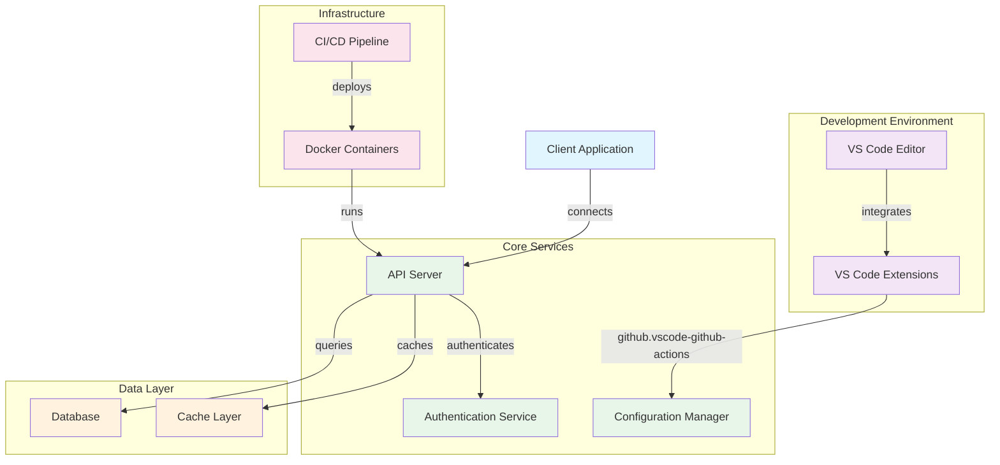

# Architecture Overview

This document outlines the architecture of the gargled-host project.

## System Architecture

## Components

### Development Environment
- **VS Code Editor**: Primary IDE for development
- **VS Code Extensions**: Recommended extension is `github.vscode-github-actions` for GitHub Actions integration

### Core Services
- **API Server**: Main application service handling requests
- **Authentication Service**: Manages user authentication and authorization
- **Configuration Manager**: Handles application configuration and settings

### Data Layer
- **Database**: Persistent data storage
- **Cache Layer**: In-memory caching for performance optimization

### Infrastructure
- **Docker Containers**: Containerized deployment of services
- **CI/CD Pipeline**: Automated testing and deployment workflows

## Key Technologies

- **Editor**: Visual Studio Code
- **Languages**: Likely Node.js/TypeScript based on VS Code ecosystem
- **Deployment**: Docker
- **CI/CD**: GitHub Actions
- **Integration**: GitHub API

## Getting Started

1. Install recommended VS Code extensions
2. Set up the development environment using Docker
3. Configure authentication credentials
4. Start the API server
5. Run CI/CD pipeline for automated deployments
